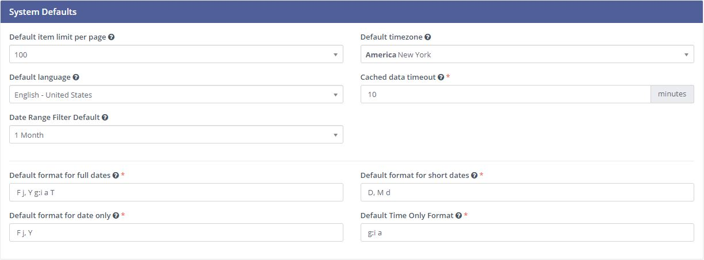
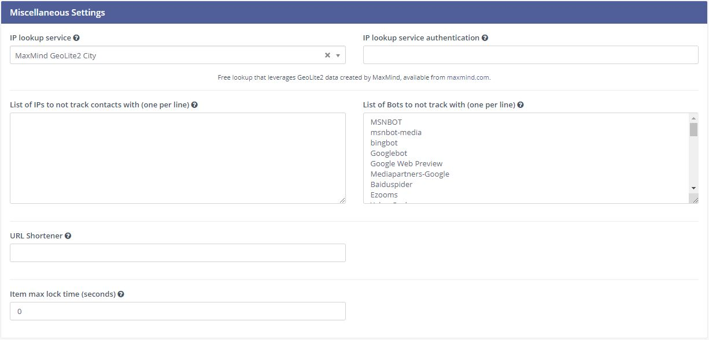
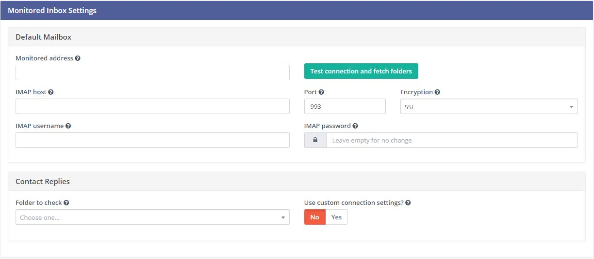

## Mautic Configuration
Mautic configuration is important for branding, performance, and the user experience. Once you’ve configured these settings,you probably won’t have to touch them again. 

Here’s an overview of each setting in the Configuration section of Mautic.

* System Settings
* Theme Settings
* API Settings
* Campaign Settings
* Email Settings
* Landing Page Settings
* Tracking Settings
* Report Settings
* Text Message Settings
* User/Authentication Settings (Single Sign-On)
* Webhook Settings
* Social Settings

## System Settings
**Mautic’s root URL**: Normally, when a user logs into his or her Mautic instance, he or she will go to `customdomain.domain.com (the root URL)`. However, that page is also accessible to the public. If a contact visits that address, he or she will see the Mautic login page for that instance. 

To brand that page, create a Mautic landing page that you’d want to greet any contacts who visit your root URL. Once you’ve done that, users can log into Mautic by visiting [customdomain.domain.com/s/login](customdomain.domain.com/s/login).

#### SYSTEM DEFAULTS

**Default item limit per page**: The number of contacts, campaigns, emails, etc. you will see on each page when you go to an item section. The default is 10.

**Default time zone**: The time zone that all users are initially set up with – typically where company headquarters is, but this can be set for each individual user. The default is UTC.

_Example: HQ is in Boston and the default is set to US Eastern Time (“America New York”). A user in San Francisco (US Pacific Time – “America Los Angeles”) can have Pacific Time shown in the UI._

**Default language**: Similar to time zone, this is the language users will be set up with. However, individual users may select their own settings. By default, Mautic uses English – United States.

**Cached data timeout**: Mautic caches some data to help speed up page loads when you’re looking at certain information. Using this field, you can change how long Mautic stores this data for (from the previous load). Mautic uses 10 minutes as the default.

**Date Range Filter Default**: In reports (including campaign and email snapshots reports on the item page), this sets the default for how far back from the current date Mautic looks for data. If you’ve changed this to something on a report, Mautic will use whatever you’ve entered.

**Default format for full dates, date only, short dates, and time only:** The defaults are set for standard US time format. The letters in the boxes are PHP code. To change these, use the PHP manual.

#### CORS SETTINGS

**Definition**: Cross-Origin Resource Sharing (CORS) allows your website and Mautic to pass data back and forth.

**Restrict Domains**: If set to no, any web page will be able to pass information back to Mautic. If set to yes, your Mautic instance will only communicate with sites listed in the “Valid Domains” box.

**Valid Domains:** These are the sites enabled to communicate with your Mautic instance. List sites you want to enable, one per line. What you enter in this box must exactly match the domain in the address bar (e.g. [https://www.mautic.com](https://www.mautic.com) will track any activity on Mautic.com pages, but [http://www.mautic.com](https://www.mautic.com) will not because it is a secure site).

#### MISCELLANEOUS SETTINGS

**IP Lookup Service**: By default, Mautic uses MaxMind GeoLite2 City to identify the city of a website visitor, based on the location of the Internet Service Provider (ISP) for their IP address. To use one of the other services available, enter your credentials in the authentication box.

**List of IPs not to track contacts with**: If you would like to disable tracking for any particular IP addresses, list those in this box, one per line. We don’t recommend adding your office IP address, in case you need to do any testing. If you list your internal IP address, Mautic won’t track clicks, page hits, etc. from that IP – including testing.

**List of Bots to not track with:** Mautic has identified and disabled tracking for several known bots. To track activity from those bots, simply remove them from this list. To disable tracking for other bots, add them here (one per line).

**URL Shortener**: If you use a URL shortening service (e.g. bit.ly), paste your access token here. For bit.ly, use [https://api-ss..bitly.com/v3/shorten?access_token=[ACCESS_TOKEN]&format=txt&longUrl]](https://api-ss..bitly.com/v3/shorten?access_token=[ACCESS_TOKEN]&format=txt&longUrl)

Item max lock time: When a user begins editing an item (campaign, email, landing page, etc.), it becomes locked to prevent other users from editing simultaneously. When the initial user saves and closes or cancels out, the item may remain locked for this period of time. The default is 0 seconds.

## Theme Settings

**Default theme:** This applies a theme to any form that does not have a theme applied to it. If you don’t have a landing page specifically set up to be your preference center, but have preference settings turned on in Email Settings (see below), Mautic will create a default preference center page using the form styling from the theme you select here.
 
##  API Settings
Full API documentation is available here.

**API enabled:** This will need to be enabled to pass data in and out of Mautic via API.

**Enable HTTP basic auth?:** Enables basic authentication for Mautic’s API. We highly recommend only using this with secure sites (HTTPS).

**Access token lifetime:** When authorizing a new application or integration, this limits how long the access token is valid (in minutes). The default is 60 minutes.

_Example: You set up a new integration to your SaaS platform. With “30” in this box, the access token will be valid for 30 minutes. If you have not completed the authentication in that period of time, you will need to revalidate._

**Refresh token lifetime:** When using OAuth 2.0, the lifetime of the refresh token which is used to request a new access token once expired. Once the refresh token expires, you’ll have to reauthorize. The default is 14 days.

## Campaign Settings

Wait time before retrying a failed action: If for any reason a campaign action does not execute, this is the length of time Mautic will wait before trying again.

## Email Settings

**Name to send mail as:** The default for who your emails will appear to be coming from. Often this is something like {YourCompany} Marketing Team or just {YourCompany}.

**Email address to send mail from:** The email address that goes with the name you’re sending mail from. It’s what will appear in the “From:” field when your contacts receive your emails.

Note: You’ll want to make sure your sender domain is set up and SPF & DKIM records properly configured. Read more about that in our email domains document.

Mailer is owner: If contacts in Mautic have “owners”, switching this setting to “on” will make it appear as though that owner is sending all emails to the contacts they’re listed as the owner for.

  Note: Mailer is owner reigns supreme, overriding any other name/email to send mail from. That includes the default as well as individual emails. Every contact owner’s domain also needs to have SPF and DKIM records set up.

**Service to send mail through:** For most Mautic customers, this should remain as “Mautic”. With that, your emails will be routed through our Sparkpost account. If you are sending through your own email service, select that service and enter your credentials.

#### DEFAULT FREQUENCY RULE

**Do not contact more than each:** This limits the number of marketing messages that a contact receives in a certain period of time (day, week, month). Transactional messages do not count towards this limit. You can adjust this at the individual contact level, either manually or via preference center setting.

_More information is available in our Default Frequency Rule document._

#### MONITORED INBOX SETTINGS

Default Mailbox: If email addresses your messages are going to bounce, this inbox is where you will receive those bounce notifications.

Contact Replies: Similar to the monitored inbox for bounces, this is the inbox Mautic will check for contact replies. If you want to use “Replies to email” decisions in any campaigns, this must be configured. With “Use custom connection settings?” set to no, Mautic will check the default mailbox. If set to yes, you may track a different mailbox for replies.

#### MESSAGE SETTINGS

**Text for the {webview_text} token**: The message to view in browser. The default is “Having trouble reading this email? Click here.” To change that text, only change the message between the <a href=”|URL|”> and </a> tags. Don’t change the |URL| text, because that is a token for each contact.

**Default email signature:** The signature for your default emails – goes along with the name & email address to send mail as.

**Append tracking pixel into email body?:** To track email opens, this must be set to yes. Setting this to no will prevent you from tracking, reporting on, and using decisions based on email opens.

**Convert embed images to Base64:** If this is set to yes, embedded images in emails will display as code rather than images.

**Disable trackable URLs:** This option removes tracking from URLs in your emails. Setting this to yes will prevent you from tracking, reporting on, and using decisions based on link clicks. Some email service providers do not like redirecting URLs. Having trackable URLs in your emails may impact deliverability and inboxing, depending on your list.

#### UNSUBSCRIBE SETTINGS
Text for the {unsubscribe_text} token: Similar to the {webview_text} token, this box is where you can change a basic “Unsubscribe” link to something different (e.g. “Update your contact preferences” or “Don’t want to hear from us anymore? Click here.”) Again, only edit between the <a href=”|URL|”> and </a> tags and don’t change the URL as it will be tokenized. If you add {unsubscribe_url} as a token somewhere in the email, you won’t see this text. 

Unsubscribed and resubscribed confirmation message: If a contact unsubscribes or resubscribes, this is the message that will display on the page after the respective action. Do not edit the |EMAIL| token, or the |URL| token within the <a href> tag.

Show contact preference settings: If you have a preference center set up, the unsubscribe link will direct to the preference center if this is set to yes. If you haven’t created a preference center, Mautic will create a default page with the next 5 settings based. The default theme will determine the styling.

Show contact segment preferences: To enable a contact to change which segments he or she is part of on the preference center page, toggle this to Yes. Segments won’t appear on the preference center page if they aren’t published and public.

Show contact frequency preferences: If set to Yes, this enables an individual to limit the number of marketing messages they receive on each channel from the preference center.

Show pause contact preferences: If set to yes, a contact can disable messages from your Mautic account to their email address for a specified date range – this is not a full unsubscribe, and at the end of that date range the messages will begin being sent to that address once again.

Show contact’s categories: If you have categories set for contacts, campaigns, emails, etc., and set this option to Yes, the contact will be able to opt out of the categories they choose from the preference center page.

Show contact’s preferred channel option: If you have multiple channels available within your Mautic account (email, SMS, mobile push, web notifications, etc.), contacts may choose their preferred channel. This can be useful if you are using or would like to use the Marketing Messages feature of Mautic.

More information about the Preference Center is available here.