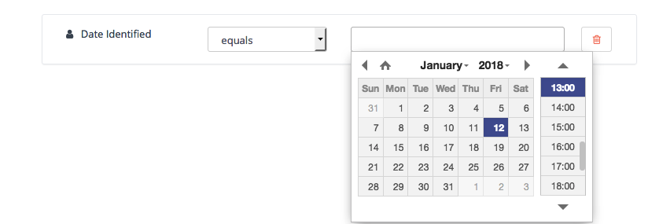

## Date Option
This is for more advanced user, who may need to specify a certain date or time frame. The first option is to use the vanilla “date picker”

However, you can specify much more here. Mautic recognizes relative date formats too (these strings are not translatable):

* +1 day (you can also use 1 day)
* -2 days (you can also use 2 days ago)
* +1 week / -2 weeks / 3 weeks ago
* +5 months / -6 months / 7months ago
* +1 year / -2 years / 3 years ago

Example (Consider that today is 2018-03-02):

* Date identified equals -1 week returns all contacts identified on 2018-02-23.
* Date identified less than -1 week returns all contacts identified before 2018-02-23.
* Date identified equals -1 months returns all contacts identified on 2018-02-02.
* Date identified greater or equal -1 year returns all contacts identified on 2017-03-02 and after.
* Date identified greater than -1 year returns all contacts identified after 2017-03-02.

Beside this, you can also specify your date with text. These formulae are translatable, so make sure you use them in the correct format corresponding to the language your Mautic instance is configured to use.

* birthday / anniversary
* birthday -7 days / anniversary -7 days
* today / tomorrow / yesterday
* this week / last week / next week
* this month / last month / next month
* this year / last year / next year

Example (Consider that today is 2018-03-02):

* Date identified equals last week returns all contacts identified between 2018-02-26 and 2018-03-04 (Monday to Sunday).
* Date identified less than last week returns all contacts identified before 2018-02-19.
* Date identified equals last month returns all contacts identified between 2018-02-01 and 2018-02-28.
* Date identified greater or equal last year returns all contacts identified 2017-01-01 and after.
* Date identified greater than last year returns all contacts identified after 2017-12-31.
* Custom contact date field equal birthday -1 day returns all contacts identified every year on 03-01 (1st March).
* Custom contact date field equal anniversary -1 month returns all contacts identified every year on 02-01 (1st February)