##  What is Marketing automation? 
Marketing automation is the use of software to deliver personalized messages to customers and leads. The software allows you to create a dynamic series of messages to send to your contacts. Marketing automation offers an exciting opportunity for greater efficiency, cost reduction, and an enhanced customer experience.

##  What is Mautic?
Mautic is the world’s first open-source marketing automation system.

## What does Mautic offer?
* Campaign Management
* Customer Lifecycle Management
* Contact Management
* Integrations and Plugins
* Reports and Dashboards

### Intelligent Marketing automation means:
* **Being able to make real-time, data-driven decisions** that have a significant impact on the performance of existing marketing efforts and future strategic planning.
* **Having the required information** to facilitate post-campaign performance reviews. These help you ensure that goals have been met, and if they have not been met, understand why, and how to improve future efforts.
* **Providing insight and actionable intelligence** which is invaluable for goal setting, campaign planning, and understanding of what ‘success’ looks like for you.

### Do I need to learn all of that at once?
No, Mautic is easy to learn and get started with. You can start using one part, and gradually expand what you use over time.  That’s the beauty of Mautic, it can evolve with you on this journey.

## How do I install Mautic?
You can manually install Mautic by [downloading the latest version] [mautic download] of the marketing automation software, or through a semi-automated process offered by third party tools such as [Softaculous][softaculous], [Bitnami][bitnami], and [Digital Ocean][digital ocean].  

If you install Mautic manually, you will need to upload the Mautic package (a zip file) to your server; unzip the files, and then navigate to that location in your browser. 

You will find Mautic has a very easy to follow the on-screen installation process [here][installation].

## How do I set up basic configurations in Mautic? 
Awesome! You've downloaded your marketing automation tool. That's a great first step, but now you wonder where to go from here. Follow [this][mautic-cloud] guide to configure using your shiny new toy!

## What are cron jobs and how do I set up cron jobs on Mautic?
Mautic requires a few cron jobs to handle some maintenance tasks such as updating contacts or campaigns, executing campaign actions, sending emails, and more.  Without them, nothing will happen in Mautic - so you must set them up! Here is the [documentation][cron-jobs] on how to set up the necessary cron jobs.

## Adding your tracking pixel
If you are using CMS platforms like Wordpress there are lots of [plugins][plugins] which make the implementation of tracking super easy. Mostly you just need to copy and paste your Mautic domain and the plugin will do the rest.

Otherwise, to enable Mautic to track website activity, you need to implement a tracking pixel. To find your tracking pixel, open Mautic and go to Settings → Configuration → Tracking settings. 

You can either use the Javascript shown above and copy that into the HTML of your website or you can just use a simple tracking pixel by replacing the domain and the path to your Mautic If you do not allow Javascript on your website. 

##### Anonymize IP
To be compliant with the GDPR you need to anonymize IP addresses. This is turned on by default. 

## How do I use contacts in Mautic?
Contacts are the central factor of a marketing automation platform. These are all the individuals who have visited your websites or interacted with you in some way.  

Here is a walkthrough on how to quickly add, view and interact with your contacts in Mautic
* Click **Contacts** in the Main Menu.

* On the right side of this page, you can manually add contacts one at a time, import contacts via a CSV file (must be encoded in UTF-8), or export all your contacts to a CSV/spreadsheet.

* **Select a contact** and **click the green arrow**. This is where you can manually update one or more contact’s campaigns, segments, stages, and contact status. You can also export the selected contacts or delete the selected contacts.

Here is a [documentation][contacts] on how to interact with, add, manage, import your contacts - both visitors and standard contacts, and also manage segments, custom fields, and message queues in Mautic. 

## How do I use channels in Mautic?
Channels are the delivery pathways (marketing messages, email, web notifications, text messages, and social media) you will use from Mautic to publish your Components. 

The pathways you choose should be selected based on the ideology of _sending the right content, to the right target persona, at the exact time they are searching for it based on their buying Journey_
 
Here is the [documentation][channels] on how to use channels (marketing messages, emails, web notifications, text messages, and social monitoring) in Mautic.

**Note:** All of these must be created or configured before you can use them in a campaign.

## How to make use of segments in Mautic
Segments provide ways to easily organize your contacts. Once contacts are `known`, you can begin to create segments or lists of people based on common interests, location, how they came into Mautic, or even how they’ve interacted with you over time. These can be done manually or completely automated through form and campaign actions.

Here is a walkthrough on how to create a segment that is going to be empty until unknown site visitors are identified by filling out a form and submitting their information.
* Click on **Segments** in the main menu.

* Click **New** and call it **First Contact.**

* Click **Save** and **Close**.

## How do I create my first Mautic campaign?
Campaigns are used to create an automated workflow to assist with your marketing efforts. It consists of various external points of contact which will engage your contacts. These engagements can be created to occur on predefined time intervals or in response to specific contact actions.

Components are the deliverables you will create in Mautic to be used in your marketing campaigns (assets, landing pages, forms, thank you pages, calls-to-action, and dynamic content).

## Exploring other features in Mautic and how they work together
Creating campaigns involves picking a name, creating a description, and defining the segments to associate with the campaign. These campaigns can then be assigned a category and defined publishing information. 

To set up a Campaign based on information coming from a form completed by a visitor, you’ll need to execute the following tasks:
1. Create a form that will be embedded on your landing page.
2. Set up a simple landing page with compelling copy and imagery related to your offer.
3. Create a simple thank you or follow-up email that will be sent once the form has been submitted.
4. Design a Campaign that will perform actions when the form is submitted.
5. Test the Form
6. Track the performance of Mautic Campaign
7. Create a report
8. Review the results on your dashboard.

#### 1.  Create a form that will be embedded on your landing page
We’re going to create a simple form for this exercise with just a first name and an email address. Forms in Mautic can ask for virtually any information, you’ll just need to identify the fields for storing the information. 

For this, you can just use the `first name and email` fields that Mautic provides.

* Click on** Components** and then **Forms**.
* Click **New**.

* Select **Campaign Form**.

* Enter **First Contact** for the name. Leave the rest of this screen as is.

* Click on **Fields.**
* To add a new field, **click on Add a field**, and select Text. You’ll notice that certain fields are required ( * ). In the Label field, type **First Name.**
* Click on **Contact Field** and in the dropdown, select** First Name**.

* Click **Add**.
* Click **Add a field** and select** Email**.
* Enter **Email** for the label.
* Click **Add** (the contact field is selected for you in this case)

* Click **Save** and **Close**

#### 2. Set up a simple landing page
* Click on **Landing Pages.**
* Click **New**.
* On the right side, enter “**My First Landing Page**” for the title. 
* Select the **Oxygen template**. 
* Click on the **Builder button**.
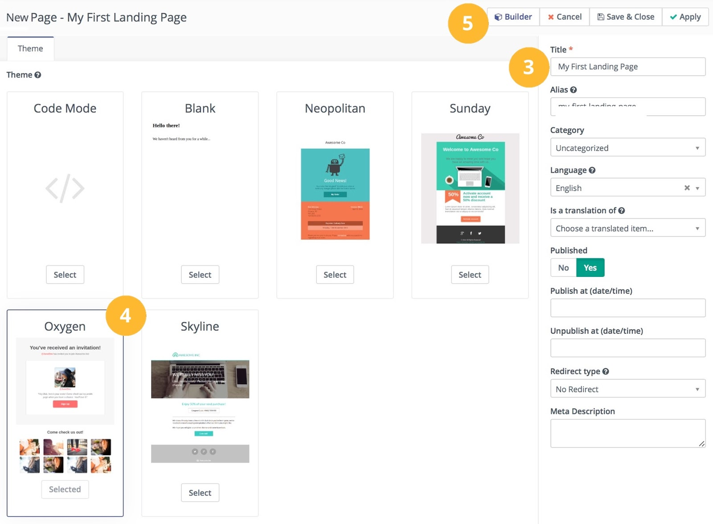
* Click on the text field. A box will appear and the text will be in the editing window on the right.
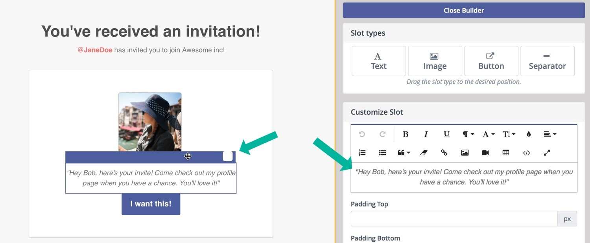
* Let’s insert the form token on your landing page, type **{** (shift square bracket – top right side of the keyboard), in the editor menu. Click on My **First Form**.
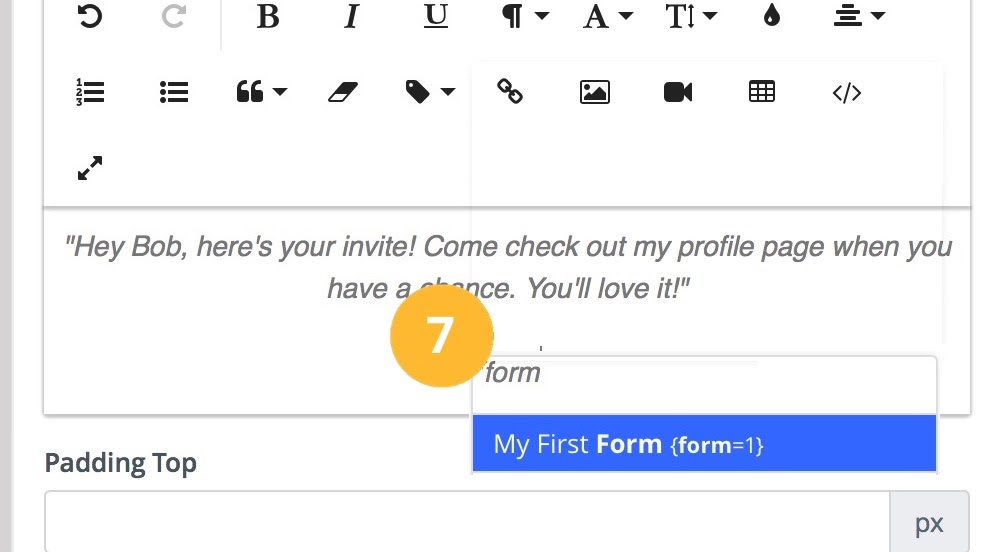
* Click **Save** and **Close**.

* Click on the Public Preview link (on the right side of the page). Confirm that the form is embedded in the page but don’t fill in the form yet.

#### 3. Create a thank you email
One of the most common ways to follow up with the people who fill in your forms is to send them an email with a white paper or other downloadable asset attached.
* In the main menu, click on **Channels** and then **Emails**.
* Click **New**.

* Select **New Template Email**. You’ll notice that we have the same templates available in Emails as we did in Landing Pages. You can use a template, create your own, or simply create an email with no template.
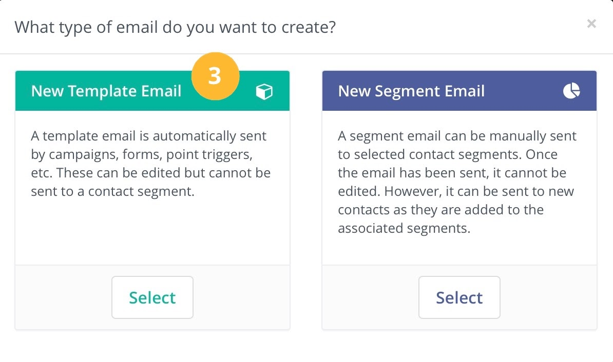
* Select **the Blank template** for this exercise.
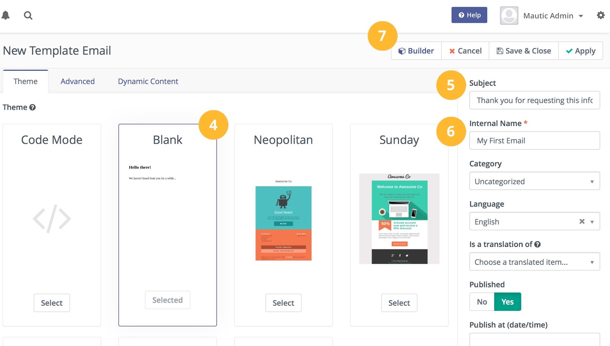
* In the subject field, type “**Thank you for requesting this information!**”
* For the Internal Name, type “**My First Email**”.
* Click on the **Builder tab**.
* **Click anywhere** in the text.
* On the right side in the editor window, highlight the text in the email but not **{unsubscribe_text} | {webview_text}**, and remove it by pressing delete or backspace.
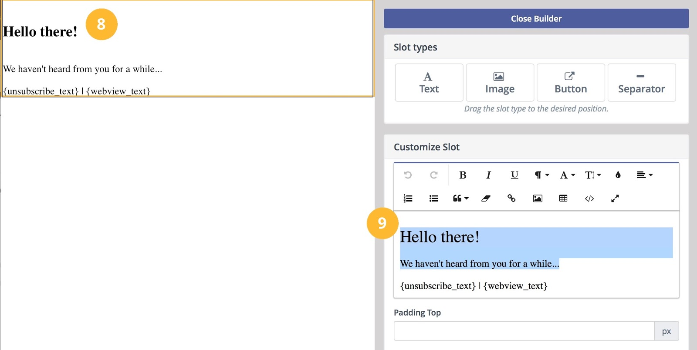
* Type “**Hi**” and then add a space to separate your greeting from the recipient’s name.
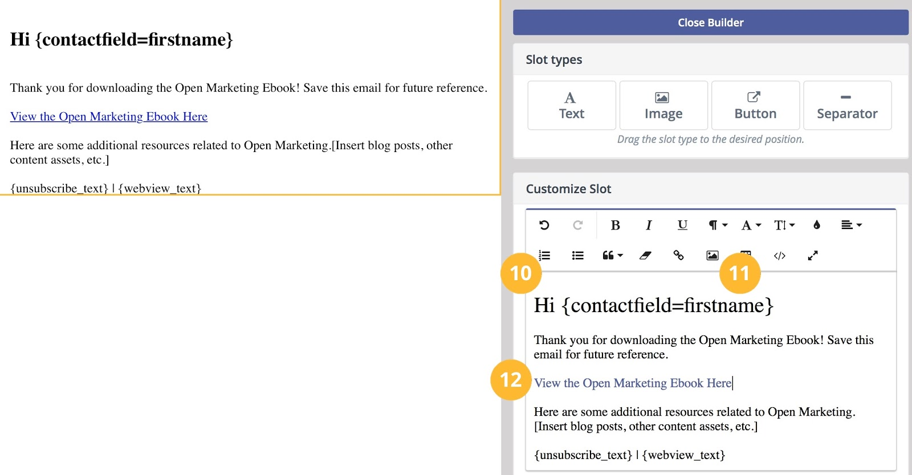
* Let’s personalize this email using tokens. To use these tokens, type  **{**, and a list of tokens you can use will be displayed. Type “**fir**” after the **{** and you’ll see the token for a contact’s first name. Click on that and it will be translated to {contactfield=firstname}. You can insert the value of any field in Mautic this way.
* Type the following into the email: **_Thank you for downloading the Open Marketing Ebook! Save this email for future reference. View the Open Marketing Ebook. Here are some additional resources related to Open Marketing(Insert blog posts, other content assets, etc)._**
* Click **Close Builder**.
* Click **Save** and **Close**.
 
#### 4. Campaign Setup
Now that you have your form; landing page and email created, we can configure our first campaign. Campaigns are where we bring all of our work together! Campaigns are very flexible. They are made up of conditions, decisions and actions.
* Click on **Campaigns** and click **New**.
* In the Name field type: **My First Campaign**.
* Click on **Launch Campaign Builder**.
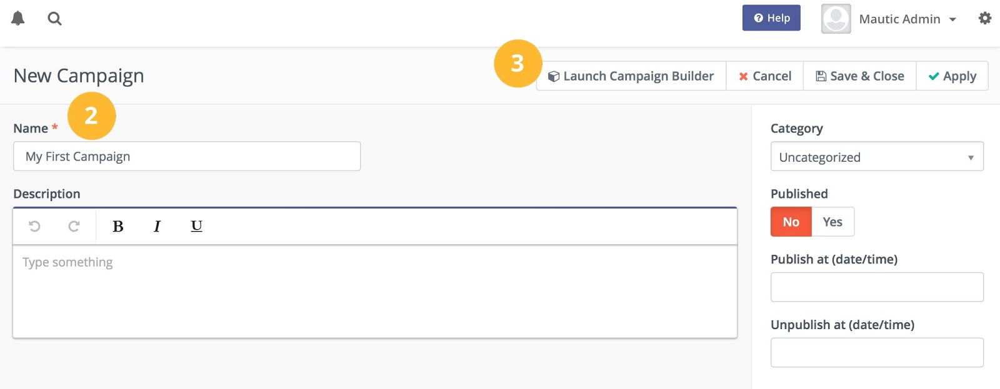
* Campaigns begin with a Contact Source. This is either a segment or a form Select **Campaign forms**.
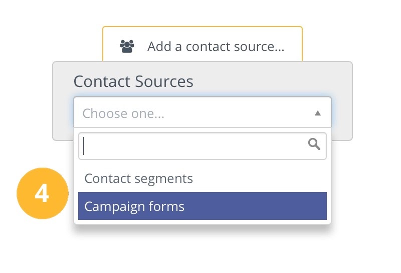
* Click in the field and select the form you created earlier.
* Click **Add**.

* Click on the grey semi-circle (“connector”)
* Click the **Action Select button**.
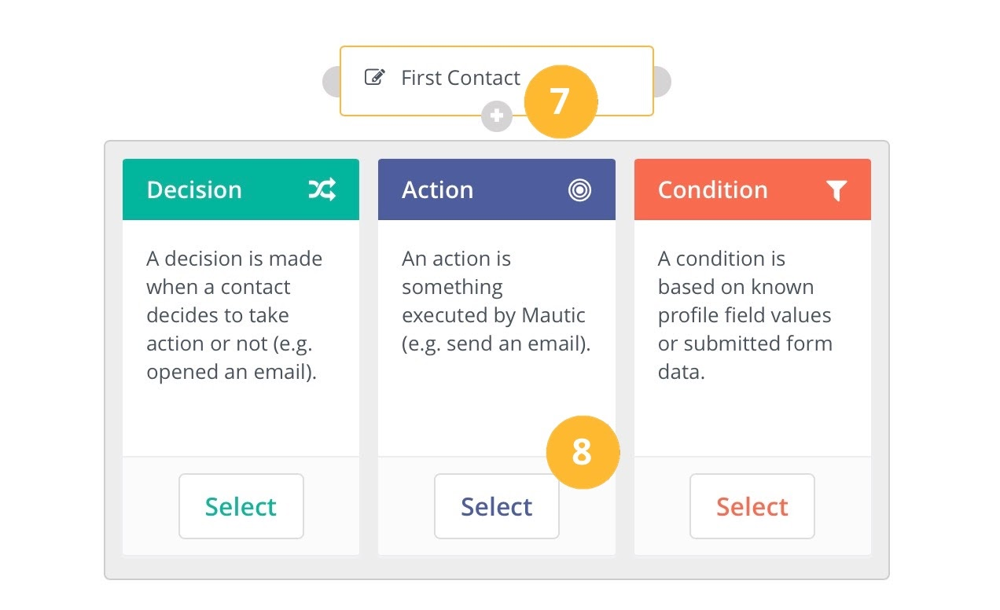
* Click on **Modify Contact’s Segments**.
* Type “**Move to First Contact Segmen**t” in the Name field.
* Click in the Add **contact to segment field** and select the “**First Contact**” Segment.
* Click Add.
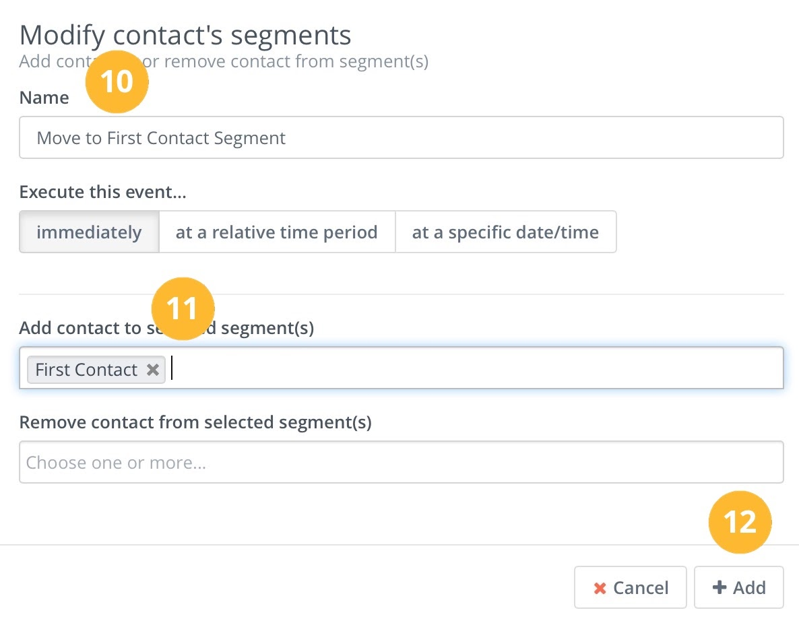
* You will notice a line drawn from between the two boxes. This is called “**connector**”. It is drawn between the “**anchors**” on each box.
* Hover over the anchor on the upper box and click. Select **Action**and then Send **Email**.
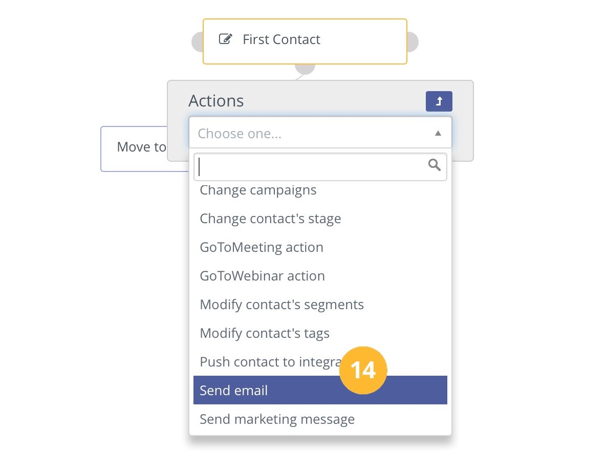
* Name the action “**Send 1st Email**”.
* Select “**My First Email**” from the Email to Send dropdown.
* Click **Add**.
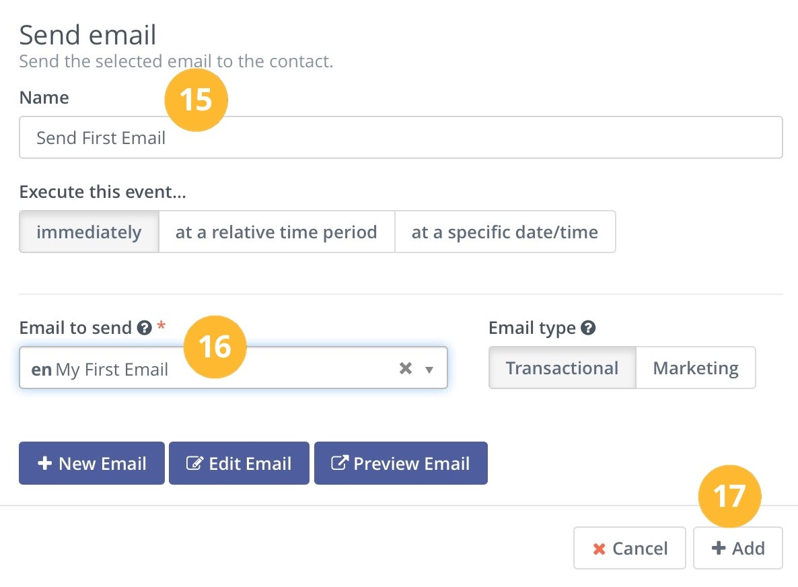
* The last step is to add 10 points to their profile if they open the email. Click on the anchor on the “**Send First Email**” box.
* Select** Decision**. Select “**Opens Email**” from the dropdown.
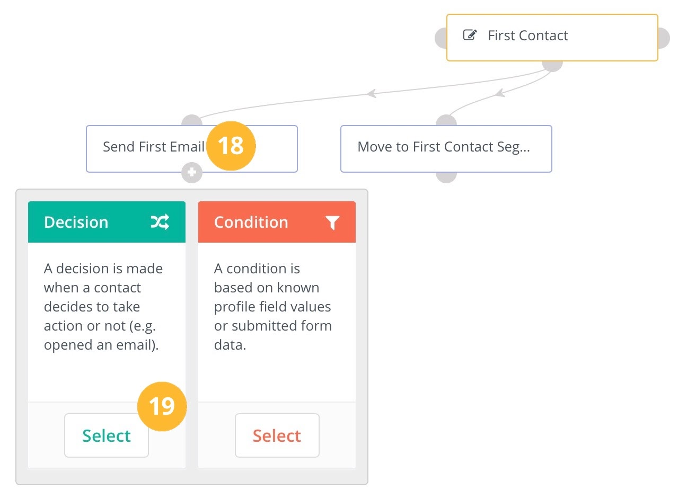
* Enter “**Opens 1st Email**” in the Name field and click **Add**.
* Click on the left anchor, and select **Action**, then Adjust contact points.
* Enter “**Add 10 points for email open**” for the name field and enter “10” in the points field. Click **Add**.
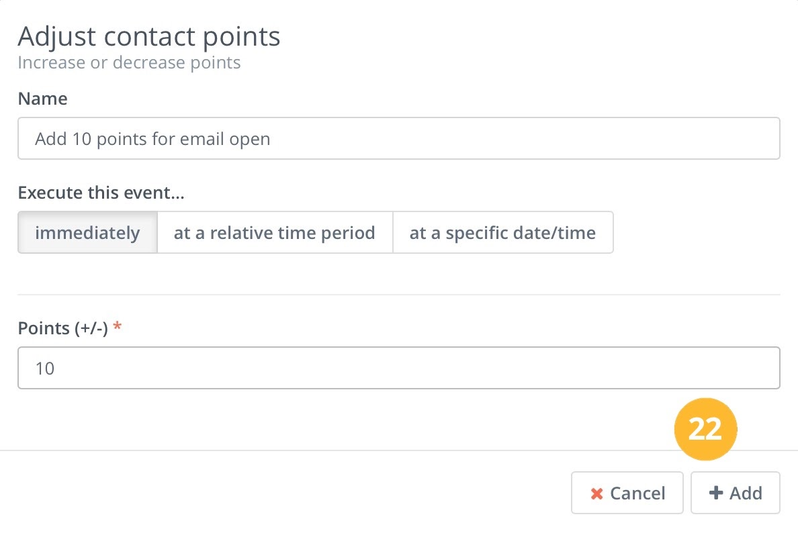
* Click **Close Builder**.
* Click on “**Yes**” to publish the campaign.
* Click **Save** and **Close**. You’ll see the statistics for this campaign.
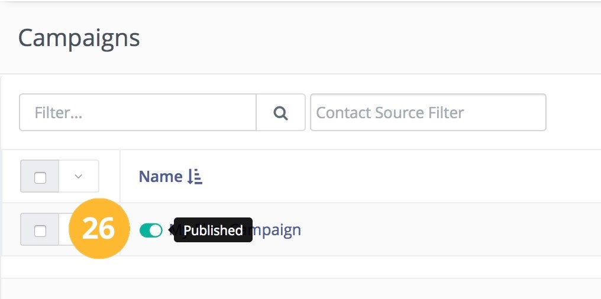
* Make sure the campaign is published. If not, click the slider to change it to published.

#### 5. Form Test
The only thing left to do is test your new campaign!

1. Click on **Components** and then **Landing Pages**.
2. Click on **My First Landing Page**.
3. Copy the URL for the Public Preview (right-click on the URL and click “Copy”).
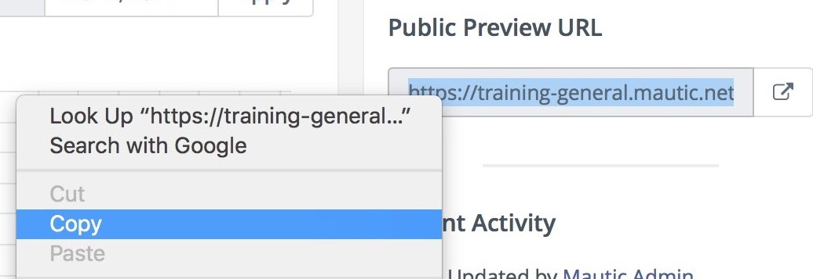
4. Either log out of Mautic or open an incognito browser.

Paste the URL into the address bar of your browser. You should see your landing page. Go ahead and fill in the form using your real name and email address.
 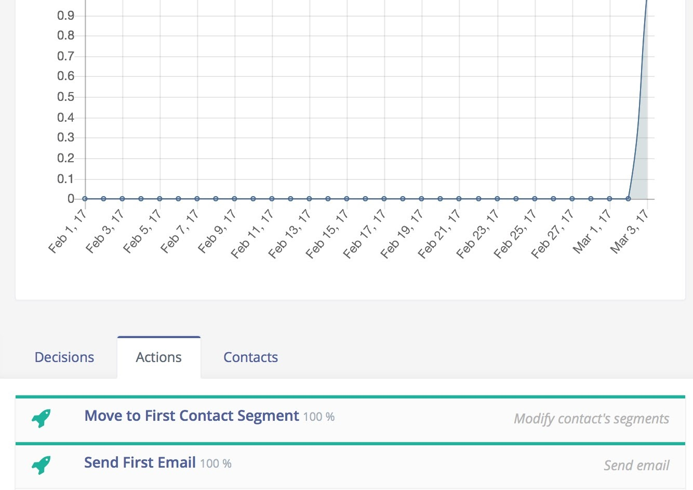
5. Head back over to Mautic and click on **Campaigns -> My First Campaign**. You’ll see that one person has been processed in the campaign. Click on the **Actions tab** to see what actions have been performed so far.
6. Click on **Channels**, then **Emails**. You’ll see that one email has been sent. Check your email. (it may take a few minutes to arrive).

#### 6. Track the performance of Mautic campaigns
There are specific metrics you’ll want to review to understand both granularly and holistically regarding how your Campaign performed.

A few examples of the granular items you’ll want to review are:

* Click on the Form to see who responded.
* Click on the Email to see sends, bounces, and opens.
* Click on any Contact to see their entire history.
* Click on any Campaign to see every action that was triggered.
For an holistic view of Campaign performance, Mautic has several reports you can use to measure progress. To review your Reports, perform the following:
* Click on **Reports**.
* Click on Leads and Points to see an example.

Reporting is only as valuable as the actionable intelligence derived from it. A few examples of actionable intelligence:
* Using data to analyze overall marketing efforts to optimize spend, resource allocation, and inform future planning.
* Using data in real-time to make changes to individual campaign components and delivery channels to ensure the right content gets to the right people at the exact time they need it. Marketing intelligence will improve organizational efficiency and effectiveness allowing your team to go beyond campaign execution. It allows a marketer to focus on improving the end-user experience at each stage of the buyer’s journey.

#### 7. Create a report

1. In the Reports section, click **New**.
2. Enter a name – Form Submissions in 2020.
 
3. Populate the data source from which you want to create the report. Choose Form Submissions from the data source drop-down.
4. Click on the Data tab to specify the columns and filters you want in your report.
 
5. Click on the **Data tab** to specify the columns and filters you want in your report.
6. Click **Save** and **Clos**e, analyze the data, and optimize as necessary.

#### 8. Dashboard review & customization
In addition to reports, the dashboard is a great place to see how your campaigns are performing in real-time.
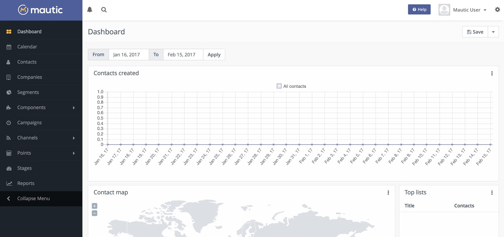
**It’s your information center.** The dashboard is flexible and fully customizable so you can view the metrics that are important to you in real-time.

Mautic allows each account user the flexibility to fully customize their dashboard view. There are several widgets out-of-the-box in Mautic which will allow users to see performance data that will be relevant to their role.  Dashboards can be exported and imported with ease, so you can create a template and easily apply it across different user accounts or Mautic instances.

## I still have questions?

We are always happy to help. You can send your questions to our [slack channel][slack] or the [Mautic forum][forum].

 [mautic download]: <https://www.mautic.org/download>
 [softaculous]: <https://www.softaculous.com/apps/others/Mautic>
 [bitnami]: <https://bitnami.com/stack/mautic/installer>
 [digital ocean]: <https://www.digitalocean.com/community/tools/mautic>
 
 [installation]: <https://mauteam.org/mautic/mautic-admins/mautic-installation-in-3-simple-steps-on-a-vps/>
 [mautic-cloud]: <https://mautic.com/help/getting-started-mautic-cloud/>
 
 [cron-jobs]: <https://docs.mautic.org/en/setup/cron-jobs>
 [plugins]: <https://www.mautic.org/marketplace>
 [contacts]: <https://docs.mautic.org/en/contacts>
 [channels]: <https://docs.mautic.org/en/channels>
 
 [slack]: <https://mautic.org/slack>
 [forum]:<https://forum.mautic.org>