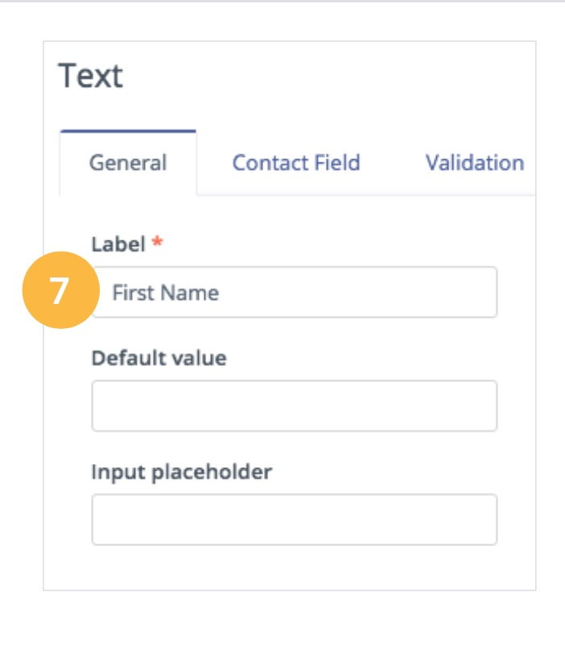
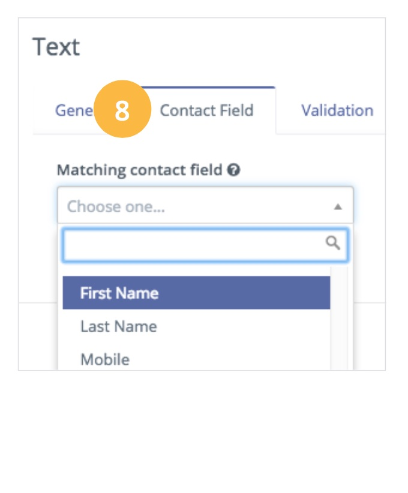

##  What is Marketing automation? 
Marketing automation is the use of software to deliver personalized messages to customers and leads. The software allows you to create a dynamic series of messages to send to your contacts. Marketing automation offers an exciting opportunity for greater efficiency, cost reduction, and an enhanced customer experience.

##  What is Mautic?
Mautic is the world’s first open-source marketing automation system.

## What does Mautic offer?
* Campaign Management
* Customer Lifecycle Management
* Contact Management
* Integrations and Plugins
* Reports and Dashboards

### Intelligent Marketing automation means:
* **Being able to make real-time, data-driven decisions** that have a significant impact on the performance of existing marketing efforts and future strategic planning.
* **Having the required information** to facilitate post-campaign performance reviews. These help you ensure that goals have been met, and if they have not been met, understand why, and how to improve future efforts.
* **Providing insight and actionable intelligence** which is invaluable for goal setting, campaign planning, and understanding of what ‘success’ looks like for you.

### Do I need to learn all of that at once?
No, Mautic is easy to learn and get started with. You can start using one part, and gradually expand what you use over time.  That’s the beauty of Mautic, it can evolve with you on this journey.

## How do I install Mautic?
You can manually install Mautic by [downloading the latest version] [mautic download] of the marketing automation software, or through a semi-automated process offered by third party tools such as [Softaculous][softaculous], [Bitnami][bitnami], and [Digital Ocean][digital ocean].  

If you install Mautic manually, you will need to upload the Mautic package (a zip file) to your server; unzip the files, and then navigate to that location in your browser. 

You will find Mautic has a very easy to follow the on-screen installation process [here][installation].

## How do I set up basic configurations in Mautic? 
Awesome! You've downloaded your marketing automation tool. That's a great first step, but now you wonder where to go from here. Follow [this][mautic-cloud] guide to configure using your shiny new toy!

## What are cron jobs and how do I set up cron jobs on Mautic?
Mautic requires a few cron jobs to handle some maintenance tasks such as updating contacts or campaigns, executing campaign actions, sending emails, and more.  Without them, nothing will happen in Mautic - so you must set them up! Here is the [documentation][cron-jobs] on how to set up the necessary cron jobs.

## Adding your tracking pixel
If you are using CMS platforms like Wordpress there are lots of [plugins][plugins] which make the implementation of tracking super easy. Mostly you just need to copy and paste your Mautic domain and the plugin will do the rest.

Otherwise, to enable Mautic to track website activity, you need to implement a tracking pixel. To find your tracking pixel, open Mautic and go to Settings → Configuration → Tracking settings. 

You can either use the Javascript shown above and copy that into the HTML of your website or you can just use a simple tracking pixel by replacing the domain and the path to your Mautic If you do not allow Javascript on your website. 

##### Anonymize IP
To be compliant with the GDPR you need to anonymize IP addresses. This is turned on by default. 

## How do I use contacts in Mautic?
Contacts are the central factor of a marketing automation platform. These are all the individuals who have visited your websites or interacted with you in some way.  

Here is a walkthrough on how to quickly add, view and interact with your contacts in Mautic
* Click **Contacts** in the Main Menu.

* On the right side of this page, you can manually add contacts one at a time, import contacts via a CSV file (must be encoded in UTF-8), or export all your contacts to a CSV/spreadsheet.

* **Select a contact** and **click the green arrow**. This is where you can manually update one or more contact’s campaigns, segments, stages, and contact status. You can also export the selected contacts or delete the selected contacts.

Here is a [documentation][contacts] on how to interact with, add, manage, import your contacts - both visitors and standard contacts, and also manage segments, custom fields, and message queues in Mautic. 

## How do I use channels in Mautic?
Channels are the delivery pathways (marketing messages, email, web notifications, text messages, and social media) you will use from Mautic to publish your Components. 

The pathways you choose should be selected based on the ideology of _sending the right content, to the right target persona, at the exact time they are searching for it based on their buying Journey_
 
Here is the [documentation][channels] on how to use channels (marketing messages, emails, web notifications, text messages, and social monitoring) in Mautic.

**Note:** All of these must be created or configured before you can use them in a campaign.

## How to make use of segments in Mautic
Segments provide ways to easily organize your contacts. Once contacts are `known`, you can begin to create segments or lists of people based on common interests, location, how they came into Mautic, or even how they’ve interacted with you over time. These can be done manually or completely automated through form and campaign actions.

Here is a walkthrough on how to create a segment that is going to be empty until unknown site visitors are identified by filling out a form and submitting their information.
* Click on **Segments** in the main menu.

* Click **New** and call it **First Contact.**

* Click **Save** and **Close**.

## How do I create my first Mautic campaign?
Campaigns are used to create an automated workflow to assist with your marketing efforts. It consists of various external points of contact which will engage your contacts. These engagements can be created to occur on predefined time intervals or in response to specific contact actions.

Components are the deliverables you will create in Mautic to be used in your marketing campaigns (assets, landing pages, forms, thank you pages, calls-to-action, and dynamic content).

## Exploring other features in Mautic and how they work together
Creating campaigns involves picking a name, creating a description, and defining the segments to associate with the campaign. These campaigns can then be assigned a category and defined publishing information. 

To set up a Campaign based on information coming from a form completed by a visitor, you’ll need to execute the following tasks:
1. Create a form that will be embedded on your landing page.
2. Set up a simple landing page with compelling copy and imagery related to your offer.
3. Create a simple thank you or follow-up email that will be sent once the form has been submitted.
4. Design a Campaign that will perform the following actions when the form is submitted:
*  Add the contact to Mautic
*  Add them to the “First Response” Segment
*  Send them the follow-up email.
*  Add 10 points to their profile (points are completely at your discretion).
9. Review the results on your dashboard.

#### 1.  Form Setup (Create a form that will be embedded on your landing page)
We’re going to create a simple form for this exercise with just a first name and an email address. Forms in Mautic can ask for virtually any information, you’ll just need to identify the fields for storing the information. 

For this, you can just use the `first name and email` fields that Mautic provides.

* Click on** Components** and then **Forms**.
* Click **New**.

* Select **Campaign Form**.

* Enter **First Contact** for the name. Leave the rest of this screen as is.

* Click on **Fields.**
* To add a new field, **click on Add a field**, and select Text. You’ll notice that certain fields are required ( * ). In the Label field, type **First Name.**
* Click on **Contact Field** and in the dropdown, select** First Name**.

* Click **Add**.
* Click **Add a field** and select** Email**.
* Enter **Email** for the label.
* Click **Add** (the contact field is selected for you in this case)

* Click **Save** and **Close**

 

 [mautic download]: <https://www.mautic.org/download>
 [softaculous]: <https://www.softaculous.com/apps/others/Mautic>
 [bitnami]: <https://bitnami.com/stack/mautic/installer>
 [digital ocean]: <https://www.digitalocean.com/community/tools/mautic>
 
 [installation]: <https://mauteam.org/mautic/mautic-admins/mautic-installation-in-3-simple-steps-on-a-vps/>
 [mautic-cloud]: <https://mautic.com/help/getting-started-mautic-cloud/>
 
 [cron-jobs]: <https://docs.mautic.org/en/setup/cron-jobs>
 [plugins]: <https://www.mautic.org/marketplace>
 [contacts]: <https://docs.mautic.org/en/contacts>
 [channels]: <https://docs.mautic.org/en/channels>