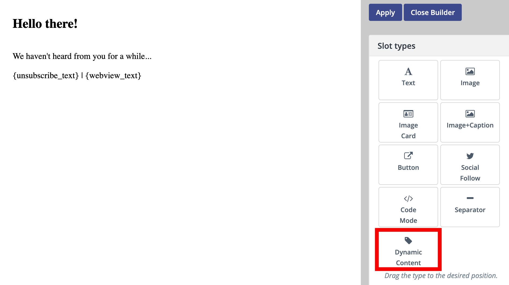
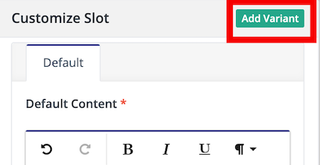
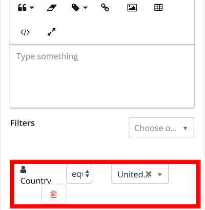

## Dynamic Content in Emails

One of Mautic key features is the ability to present highly individualized content to each and every one of your contacts, creating a better experience for each contact. Bringing this experience to another level is the usage of Dynamic Content in Emails. 

In this knowledgebase article, we will explain how you can use the power of Dynamic Content in emails as well.

## How to use Dynamic Content 

To use Dynamic Content in emails, go to channel → Emails and either create a new mail or open an existing one.

Then go and open up the email builder. On the slot type menu locate “Dynamic Content” and drag & drop it onto your email canvas.

You can now add Dynamic Content to your email. In the next step, you need to specify the default content which should be shown and the variants of that default content. 

### 1.  Adding default content

The default content is shown when the recipient of your email doesn’t match any of the variant criteria you set up in the next step. Thus the default content should be presentable to a broader audience. To make things more clear, here is an example case:

Imagine you are writing an email to photographers and illustrators. The photographer variant may get a paragraph about camera lessons. The illustrator will receive an offer for a free sketchpad. If someone has neither field populated, they may receive an more general paragraph about the company instead.
 
### 2. Setting up variants

&nbsp;

If you click on “Add Variant “ you can add different variations of your default content. To determine when which variation of the email should be sent to your contact, you add filters for each and every variant. You can have an infinite number of variants of the default content. For example, you could send out different variations of the mail for every country, giving the contact a more personalized experience. 

What works super well with adding variants are tokens. Of course, you can also add tokens to your default content, but working with tokens in different variants of the mail can give the contact an individual experience.

_That’s it, you now have the knowledge to use Dynamic Content in Emails._
